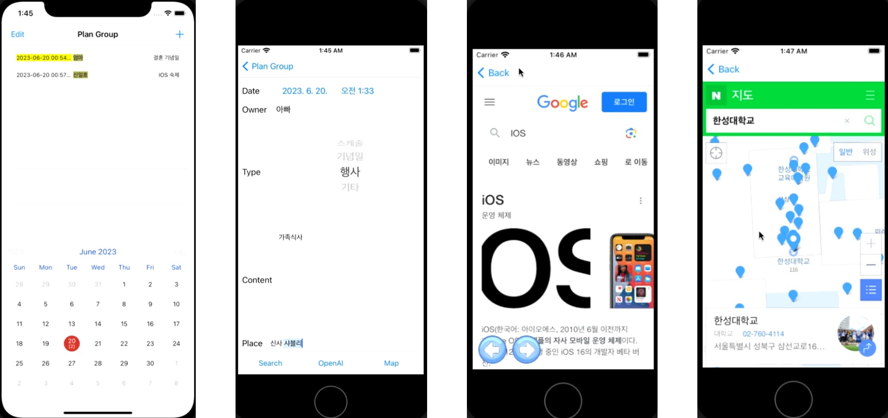

# 📅 iOS용 공유 캘린더

**설명:** IOS용 공유 캘린더 애플리케이션입니다. 애플리케이션 내부에서 웹 서칭, 지도 찾기, OpenAI API를 이용한 AI 질의응답을 할 수 있습니다.

## 프로젝트 정보

- **개발 기간:** 2023-05-29 ~ 2023-06-20
- **개발 언어:** Swift
- **개발 도구:** MacOS(VM), Xcode, OpenAI API, Firebase

## 개요

&nbsp;가족, 친구, 연인 등 서로의 일정을 공유할 필요가 있을 때 사용할 수 있는 캘린더로 자신이 입력한 일정을 구성원들이 모두 공유할 수 있으며 자신도 구성원들의 일정을 확인할 수 있습니다. 또한 일정의 내용에 대하여 궁금할 때, 검색하거나 AI에게 물어볼 수 있으며 또한 일정의 위치가 어딘지 지도로 확인해 볼 수 있습니다.

## 시스템 구조

## 기능

### (1) 캘린더
&nbsp;캘린더에서 선택된 날짜에 입력된 구성원들의 일정을 확인할 수 있습니다.

### (2) 상세 일정
&nbsp;일정의 날짜와 시간, 일정 구성원 이름, 일정의 카테고리, 일정의 내용, 장소를 입력할 수 있습니다.

### (3) 웹 서칭
&nbsp;상세 일정 화면에서 Search 버튼을 누르면 일정의 내용을 웹을 이용해 찾아볼 수 있습니다.

### (4) OpenAI API를 이용한 질의
&nbsp;상세 일정 화면에서 OpenAI 버튼을 누르면 일정의 내용을 AI에게 질문할 수 있습니다.

### (5) 지도
&nbsp;상세 일정 화면에서 Map 버튼을 누르면 스케쥴의 위치를 지도에서 찾아볼 수 있습니다.

